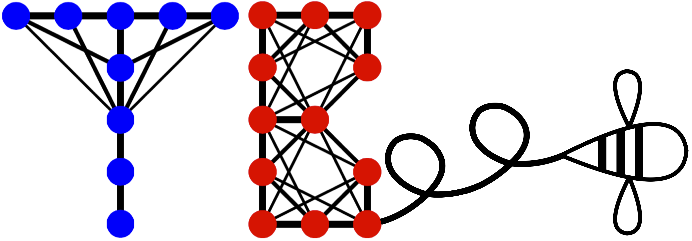

# tbee — a Tight-Binding package for research and education



**tbee** is a Python package to build and solve Tight-Binding models, written
in vectorized NumPy/SciPy. It aims to make the mechanics of Tight-Binding
models — lattices, hoppings, Hamiltonians, spectra, band structures —
explicit and easy to inspect, so it works as well for teaching as for
research prototyping.

## Features

* **Real space**: build arbitrarily complex finite lattices (flakes,
  ribbons, disordered structures, defects) site by site or via boolean
  selections (ellipses, half-planes, unions/differences of lattices), then
  diagonalize the resulting Hamiltonian directly.
* **Reciprocal space**: build the Bloch Hamiltonian `H(k)` of the infinite
  periodic lattice from a small set of intra-unit-cell hoppings, and compute
  band structures along a k-path through high-symmetry points.
* **Topology**: Berry curvature and Chern numbers of a group of bands, by
  the gauge-invariant Fukui-Hatsugai-Suzuki lattice method.
* **Spin**: optional spin-1/2 degree of freedom on every site, with 2x2
  (Pauli-matrix) hoppings/onsite terms, for spin-orbit coupling (Rashba,
  Kane-Mele) and Zeeman splitting.
* **Edge states**: cut a ribbon (periodic in one direction, finite in the
  other) out of any periodic model, to see edge/surface physics.
* **Density of states**, Gaussian- or Lorentzian-broadened, from either a
  real-space spectrum or a Brillouin-zone mesh.
* A small library of ready-made lattices (chain, square, triangular,
  honeycomb, kagome, Lieb).
* Complex-valued onsite energies and hoppings; **Hermitian and non-Hermitian**
  Tight-Binding Hamiltonians.
* Multiple sublattices, with hoppings addressed by neighbor order (1st,
  2nd, 3rd-nearest neighbor, ...), by angle, or by sublattice-pair tag.
* Built-in patterns for onsite disorder, hopping disorder, dimerization,
  strain, and an orbital magnetic field (Peierls substitution).
* Time propagation of a wavepacket under the Tight-Binding Hamiltonian
  (Crank-Nicolson).

**tbee** is organized as a small set of composable classes and modules:

| Class / module            | Purpose                                                |
|----------------------------|---------------------------------------------------------|
| `tbee.Lattice`             | Define and manipulate site positions and sublattices.   |
| `tbee.System`              | Build the real-space Hamiltonian from a `Lattice` and solve it. |
| `tbee.KSpace`              | Build and solve the Bloch Hamiltonian of a periodic `Lattice`; bands, Berry curvature/Chern numbers, ribbons, DOS. |
| `tbee.Plot`                | Plot lattices, spectra, eigenstates, and the density of states. |
| `tbee.Propagation`         | Time-evolve a wavepacket.                               |
| `tbee.Save`                | Save figures/animations to disk.                        |
| `tbee.lattices`            | Ready-made common lattices.                              |
| `tbee.dos`                 | Broadened density of states from a set of eigenenergies. |

## Install

Requires Python >= 3.10.

```bash
git clone https://github.com/cpoli/tbee
cd tbee
pip install -e .
```

or, to also install the tools needed to run the test suite:

```bash
pip install -e ".[test]"
pytest tests/
```

## Quick start

Real-space flake, nearest-neighbor square lattice:

```python
from tbee.lattice import Lattice
from tbee.system import System

lat = Lattice(unit_cell=[{'tag': 'a', 'r0': (0., 0.)}],
                       prim_vec=[(1., 0.), (0., 1.)])
lat.get_lattice(n1=10, n2=10)

sys = System(lat)
sys.set_hopping([{'n': 1, 't': 1.}])
sys.get_ham()
sys.get_eig()
print(sys.en)
```

Graphene band structure (reciprocal space):

```python
import numpy as np
from tbee.lattice import Lattice
from tbee.kspace import KSpace, reciprocal_vectors

DX, DY = 0.5 * 3 ** 0.5, 0.5
unit_cell = [{'tag': 'a', 'r0': (0., 0.)}, {'tag': 'b', 'r0': (DX, DY)}]
prim_vec = [(2 * DX, 0.), (DX, 1.5)]
lat = Lattice(unit_cell=unit_cell, prim_vec=prim_vec)

gra = KSpace(lat)
gra.set_hopping([{'i': 0, 'j': 1, 'R': (0, 0), 't': 1.},
                        {'i': 0, 'j': 1, 'R': (-1, 0), 't': 1.},
                        {'i': 0, 'j': 1, 'R': (0, -1), 't': 1.}])

b1, b2 = (np.array(v) for v in reciprocal_vectors(prim_vec))
Gamma, K, M = np.zeros(2), (b1 - b2) / 3, b1 / 2
gra.k_path([Gamma, K, M, Gamma], nk=60)
fig = gra.plot_bands(node_labels=[r'$\Gamma$', 'K', 'M', r'$\Gamma$'])
fig.savefig('graphene_bands.png')
```

A magnetic field is added with `System.set_magnetic_field` (uniform field) or
`System.set_peierls_phase` (arbitrary vector potential), applied to the
hoppings *after* `set_hopping`/`set_hopping_manual`:

```python
sys.set_hopping_manual(hop_dict)
sys.set_magnetic_field(alpha=0.01)  # flux quanta per unit area
sys.get_ham()
```

See [`examples/magnetic_field/plot_magnetic_field.py`](examples/magnetic_field/plot_magnetic_field.py) for a full
worked example (an Aharonov-Bohm ring, reproducing the textbook result that
the spectrum is periodic in the enclosed flux with period one flux quantum).

A Chern number is the Berry curvature of a group of bands, integrated over
the Brillouin zone:

```python
chern = gra.chern_number(bands=[0], nk=40)   # ~0 for plain graphene
```

See [`examples/topology/plot_haldane_topology.py`](examples/topology/plot_haldane_topology.py) for the
Haldane model (the first Chern insulator), reproducing its topological
phase transition (Chern number 1 -> 0) and Berry-curvature map.

A spin-1/2 degree of freedom is added with `KSpace(lat, spin=True)`; onsite
values and hoppings then also accept 2x2 (Pauli) matrices:

```python
from tbee.kspace import KSpace, PAULI

kmele = KSpace(lat, spin=True)
kmele.set_hopping([{'i': 0, 'j': 0, 'R': (1, 0), 't': 1j*lam*PAULI['z']}])  # intrinsic SOC
```

A ribbon -- periodic in one direction, finite in the other, the standard
way to see edge states -- is cut out of a periodic model with
`tbee.kspace.ribbon`:

```python
from tbee.kspace import ribbon

rib = ribbon(lat, list_hop, width=30, direction=1)   # 30 unit cells wide
fig = rib.plot_bands()
```

See [`examples/topology/plot_edge_states.py`](examples/topology/plot_edge_states.py) for the zigzag
graphene ribbon's zero-energy edge band, and the Kane-Mele ribbon's helical
edge states crossing a spin-orbit gap.

## Examples

`examples/` is organized as a [Sphinx-Gallery](https://sphinx-gallery.github.io/)
source tree, one topic per subfolder, each with a `README.rst` blurb. Every
`plot_*.py` script is self-contained and runnable directly
(`python examples/<section>/<script>.py`), and checks its own key numeric
claims with `assert` before plotting -- nothing is asserted in the docs
that isn't also verified in code. Building the docs (`pip install -e ".[docs]"`
then `cd docs && make html`) renders these same scripts into an executed,
thumbnailed example gallery under `docs/source/api/gallery/`.

| Script                                                                  | What it shows |
|---------------------------------------------------------------------------|----------------|
| [`tight_binding/plot_graphene_bands.py`](examples/tight_binding/plot_graphene_bands.py) | Real-space flake + reciprocal-space band structure; graphene's Dirac point and Wallace's 1947 linear dispersion. |
| [`tight_binding/plot_visualizing_a_model.py`](examples/tight_binding/plot_visualizing_a_model.py) | `tbee.plot.Plot`: lattice, spectrum with sublattice polarization, density of states, eigenstate intensity. |
| [`magnetic_field/plot_magnetic_field.py`](examples/magnetic_field/plot_magnetic_field.py) | Peierls substitution; an Aharonov-Bohm ring's flux-periodic spectrum. |
| [`magnetic_field/plot_hofstadter_butterfly.py`](examples/magnetic_field/plot_hofstadter_butterfly.py) | The fractal spectrum of a lattice threaded by a continuously swept flux. |
| [`magnetic_field/plot_landau_levels.py`](examples/magnetic_field/plot_landau_levels.py) | Landau levels: a square lattice's non-relativistic ladder vs. graphene's relativistic sqrt(n) ladder and zero mode. |
| [`topology/plot_ssh_model.py`](examples/topology/plot_ssh_model.py) | The SSH model: bulk gap closing and topologically protected edge states. |
| [`disorder/plot_anderson_localization.py`](examples/disorder/plot_anderson_localization.py) | Anderson localization: IPR vs. disorder strength, extended vs. localized states. |
| [`topology/plot_haldane_topology.py`](examples/topology/plot_haldane_topology.py) | The Haldane model: Berry curvature, Chern number, topological phase transition. |
| [`flat_bands/plot_flat_bands.py`](examples/flat_bands/plot_flat_bands.py) | Exactly flat bands on the kagome and Lieb lattices. |
| [`topology/plot_kagome_chern_band.py`](examples/topology/plot_kagome_chern_band.py) | Gapping the kagome flat band into a Chern insulator (C=-1) with complex nearest-neighbor hopping. |
| [`topology/plot_edge_states.py`](examples/topology/plot_edge_states.py) | Zigzag graphene ribbon edge band; Kane-Mele helical edge states. |
| [`dynamics/plot_bloch_oscillations.py`](examples/dynamics/plot_bloch_oscillations.py) | Wannier-Stark ladder, its localization, and Bloch oscillations under a uniform tilt. |
| [`topology/plot_thouless_pump.py`](examples/topology/plot_thouless_pump.py) | The Rice-Mele model as a Thouless quantum pump: quantized Chern number and polarization winding. |

The `examples/` directory also has five older Jupyter notebooks (graphene
flakes, kagome/Lieb/dumbbell lattices, disorder, strain, time propagation)
predating the 0.2 API refresh below.

## Documentation

* [`docs/source/tutorial.rst`](docs/source/tutorial.rst) -- a narrative walkthrough of the
  package, from building a lattice through topology, spin-orbit coupling,
  and edge states.
* [`docs/source/history.rst`](docs/source/history.rst) -- a chronology of the breakthroughs
  behind Tight-Binding theory (Bloch's theorem through the Kane-Mele model),
  each one linked to the corresponding **tbee** functionality and example
  above.
* `docs/source/tbee.rst` -- the API reference (auto-generated from docstrings).

Build the HTML docs with `cd docs && make html` (output in `docs/build/html`).

## A note on the API

Version 0.2 modernized the package to run on current Python/NumPy/SciPy and
cleaned up the API:

* Sublattice tags are plain one-character **strings** (`'a'`) rather than
  byte strings (`b'a'`).
* Classes are named in `PascalCase` (`Lattice`, `System`, ...) rather than
  lowercase names identical to their module (`lattice.lattice`,
  `system.system`, ...), which used to make `import tbee.lattice as lattice`
  silently bind the wrong object.

For continuity, the pre-0.2 lowercase class names (`lattice`, `system`,
`plot`, `propagation`, `save`) remain available as aliases of the new
classes, so `from tbee.lattice import lattice` still works. Example
notebooks predating 0.2 still use byte-string tags (`b'a'`) and will need
that one mechanical change to run on the current version.

## License

BSD 3-Clause, see [LICENSE](LICENSE).
