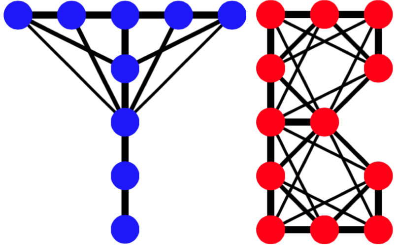

Python Tight-Binding module
======================

**TB** is a **Python** module of **Tight-Binding** models. **TB**  builds up and solves finite tight-binding models with complex-valued onsite energies and complex-valued hoppings. 

Sphinx documentation of **TB**: http://cpoli.github.io/TBdoc/indexTB.html

**TB** is composed of:

    * lattice
    * system
    * plot
    * propagation
    * save

**TB** is written in fully vectorized **Numpy**.:

**TB** main features:

    * Complex lattice structures.
    * Complex-valued onsite energies and hoppings.
    * Hermitian and non-Hermitian Tight-Binding Hamiltonians.
    * Onsite energies defined by tags.
    * Any type of hoppings:
        * Neighbors hoppings
        * Next-neighbors hoppings, 
        * Next-next-neighbors hoppings,
        * etc..
    * Hoppings defined by their type, tags, and angles.
    * Implementation of onsite energies and hopping patterns:
       * Dimerization defects (change of hopping patterns).
       * Implementation of magnetic field.
       * Implementation of strain.
       * Local value changes. 
       * Hopping disorder.
       * Onsite disorder.
    * Time propagation